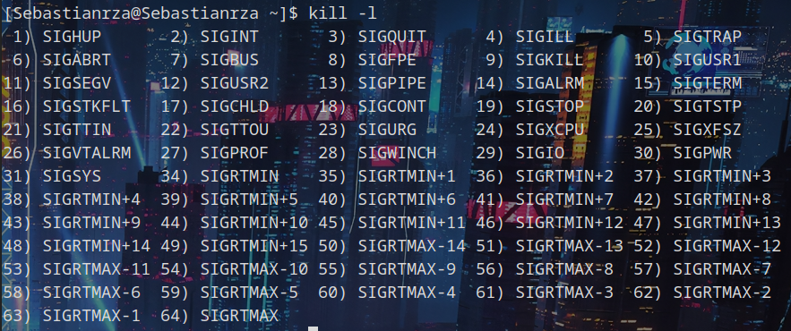

# Práctica 2.3 Procesos

## Políticas de planificación

### ************** Ejercicio 1 **************
<pre>
<code>$man chrt</code>
</pre>
Sirve para consultar la planificación y prioridad de un proceso.
<pre>
<code>$chrt -v -p </code>
</pre>
Para cambiar la planificación 
<pre>
<code>
$chrt -o -p <pid> #SCHED_OTHER
$chrt -f -p <pid> #SCHED_FIFO
$chrt -r -p <pid> #SCHED_RR
</code>
</pre>

<pre>
<code>
$man nice
$man renice
</code>
</pre>

Sirve para modificar la prioridad (modificar el valor nice de un proceso).

<pre>
<code>$sudo nice -n-10 /bin/sh
$sudo chrt -f -p 12 22152
</code></pre>

*********************** **Ejercicio 2** ***********************

[ej2](https://github.com/Sebastianrza/ASOR/blob/main/Practica2.3/Politicas_Planificacion/ej2.c)

*********************** **Ejercicio 3** ***********************

<pre>
<code>$sudo nice -n-10 /bin/sh
$sudo chrt -f -p 12 22152
$gcc -o ej ej2.c
$./ej
</code></pre>

## Grupos de procesos y sesiones Recursos de un proceso

<pre>
<code>$man ps
</code></pre>

**ps -u $USER -f** Mostrar todos los procesos del usuario actual en formato extendido.
**ps -eo pid,gid,sid,s,command** Mostrar los procesos del sistema, incluyendo PID, del grupo, la sesión, el estado y la línea de comandos.

a) El PID(y el SID) de la shell es el SID del nuevo proceso. Comparten el GID (1000)
b) 1000

*********************** **Ejercicio 5** ***********************

[ej5](https://github.com/Sebastianrza/ASOR/blob/main/Practica2.3/Grupos_de_Procesos_sesiones/ej5.c)

*********************** **Ejercicio 6** ***********************

[ej6](https://github.com/Sebastianrza/ASOR/blob/main/Practica2.3/Grupos_de_Procesos_sesiones/ej6.c)

¿Qué pasa si el padre termina antes que el hijo?

El hijo se queda huérfano y el ppid lo recoge la shell o init.

¿Qué pasa si el hijo termina antes que el padre?

## Ejecución de programas

*********************** **Ejercicio 7** ***********************

[ej7_exec](https://github.com/Sebastianrza/ASOR/blob/main/Practica2.3/Ejecucion_Programas/ej7.c)

[ej7_system](https://github.com/Sebastianrza/ASOR/blob/main/Practica2.3/Ejecucion_Programas/ej7_2.c)

La cadena "El comando terminó de ejecutarse" sólo se ejecuta cuando se usa system. Esto se debe al ejecutar el comando exec sustituye la imagen del programa a la imagen del programa que hemos pasado por argumentos.

Diferencia entre ps -el y "ps -el"

Cuando se pasa por parámetros de un programa ps -ef equivaldría a dos argumentos y si se quiere ejecutar como systme sería necesario unirlos. Mientras que "ps -el" equivale a un único string lo que nos permitiría ejecutar directamente el comando system sin necesidad de unirlos.

*********************** **Ejercicio 8** ***********************

[ej8](https://github.com/Sebastianrza/ASOR/blob/main/Practica2.3/Ejecucion_Programas/ej8.c)

## Señales
*********************** **Ejercicio 9** ***********************

<pre>
<code>$man kill
$man pkill
</code></pre>

Envía una señal a un proceso. Uso:

<pre>
<code>$kill <pid> #Envía la señal de KILL a un proceso.
$kill -9 <pid>
$kill -s <pid> #Manda una señal.
$kill -l #Lista todas las señales.
</code></pre>

Todas las señales del sistema:

*********************** **Ejercicio 10** ***********************

*Terminal 1*
<pre>
<code>$sleep 600
</code></pre>

*Terminal 2*
<pre>
<code>$kill -s <Señal_Name> <Sleep_PID>  
</code></pre>

SIGHUP: Se ha terminado el proceso (Se ha desconectado de la SHELL).

Salida:Colgar (hangup)

SIGINT: Se ha interrumpido el sleep.

Salida:N/A

SIGQUIT: Se ha interrumpido el sleep.

Salida: Abandona (core generado)

SIGILL: Se ha interrumpido el sleep.

Salida:Instrucción ilegal (core generado)

SIGTRAP: Se ha interrumpido el sleep

Salida: «trap» para punto de parada/seguimiento (core generado)

SIGKILL: Se ha interrumpido el sleep

Salida: Terminado (killed)

SIGBUS: Se ha interrumpido el sleep

Salida: Error del bus (core generado)

SIGSEGV: Se ha interrumpido el sleep

Salida: Violación de segmento (core generado)

SIGPIPE: Se ha interrumpido el sleep

Salida: N/A (Ha salido una notificación en la pantalla).

SIGTERM: Se ha interrumpido el sleep

Salida: Terminado

*********************** **Ejercicio 11** ***********************

[ej11](https://github.com/Sebastianrza/ASOR/blob/main/Practica2.3/Se%C3%B1ales/ej11.c)

*********************** **Ejercicio 12** ***********************

[ej12](https://github.com/Sebastianrza/ASOR/blob/main/Practica2.3/Se%C3%B1ales/ej12.c)

*********************** **Ejercicio 13** ***********************

[ej13](https://github.com/Sebastianrza/ASOR/blob/main/Practica2.3/Se%C3%B1ales/ej13.c)
