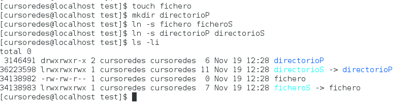
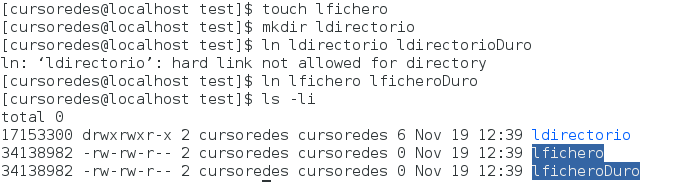
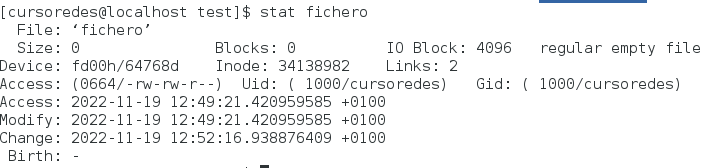

# Práctica 2.2 Sistemas de Ficheros

## Creación y atributos de ficheros

### ************** Ejercicio 1 **************

`$man ls`

-a: Muestra todos los archivos (incluidos los ocultos, "." y "..").

-l: Muestra la lista con todos los detalles (Permisos, autores, bytes, fecha de creación de cada archivo).

-d: Muestra la lista de directorios (".").

-h: Muestra los tamaños del archivo en K, M, G (Es necesario: -l o -s).

-i: Muestra el inodo asociado a cada archivo.

-R: Muestra recursivamente todo lo que hay en los directorios.

-1: Muestra un archivo por línea.

-F: Clasifica la salida (con /=>@|).

--color=auto=never: Colorea (o no) la salida del ls según el tipo de archivo.

### ************** Ejercicio 2 **************

`$ls -ld`

drwx------. 20 cursoredes cursoredes 4096 Nov 19 12:08 .

Tipo: Directorio.

rmx_propietario: lectura, escritura y ejecución.

rmx_grupo: ninguno.

rmx_resto: ninguno.

### ************** Ejercicio 3 **************

`$chmod 645 file`

 `$chmod u+rw-x,g+r-wr,o+rx-w file` 
 
### ************** Ejercicio 4 **************
 
 `$mkdir test`
 
 `$chmod -x test`
 
 `$cd test`
 
 resultado: bash: cd:test/: Permiso denegado
 
### ************** Ejercicio 5 **************

### ************** Ejercicio 6 **************
 
 `$umask 727`
 
### ************** Ejercicio 7 **************
 
 
### ************** Ejercicio 8 **************
 
 `$ls -i`
 
  `$man stat`
  
### ************** Ejercicio 9 **************
  
  
### ************** Ejercicio 10 **************

  a) 
    
    $touch fichero
    
    $mkdir directorioP
    
    $ln -s fichero ficheroS
    
    $ln -s directorioP directorioS
    
    $ls -li
    
   
   
   Se observa que los inodos para cada fichero son diferentes y que los enlaces simbólicos creados vienen representado con una "i" y se muestra a donde apunta.
 
  b)
     
     $ln directorio ldirectorioDuro
     $ln fichero lficheroduro
     $ls -li
     
   
   
   No se pueden crear enlaces duros en directorios. Además en la imagen se puede observar que tienen el mismo inodo.
   
   `$stat fichero`
   
   
  c)

      $rm -rf lficheroduro #No pasa nada
      $rm -rf ficherosS #No pasa nada
      $ln lfichero lficheroduro
      $rm -rf fichero #Se corrompe el enlace simbólico.
      
   
### ************** Ejercicio 11 **************
      
##  Redirecciones y duplicación de descriptores

### ************** Ejercicio 12 **************
### ************** Ejercicio 13 **************

##  Cerrojos de ficheros

### ************** Ejercicio 14 **************
### ************** Ejercicio 15 **************
### ************** Ejercicio 16 **************

##  Directorios

### ************** Ejercicio 17 **************
